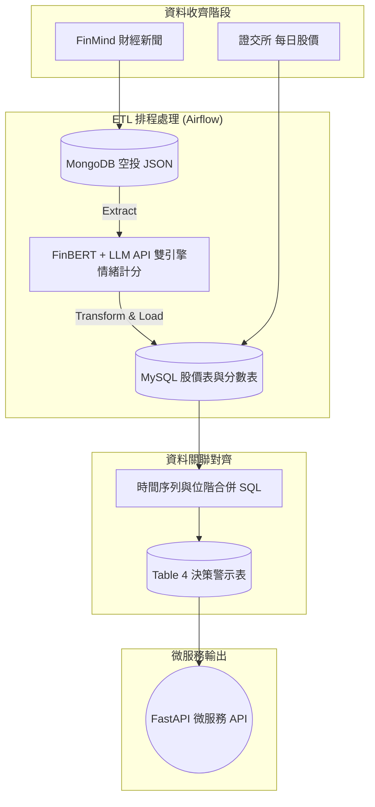

# 股票市場情緒分析與防呆避險系統 - 專案企劃書

作為期末專題，本專案不只是單純的爬蟲練習，而是一套具有真實商業價值的「資料工程與量化分析系統」。以下是專案的核心定義與藍圖方向，供團隊討論與對齊共識。

---

## 一、 為何要製作這個專案？ (Why)

在當前資訊爆炸的時代，散戶投資人最大的痛點是：**「容易被媒體帶風向，導致追高殺低，成為最後一隻老鼠」**。

這個系統就是散戶的**「防割韭菜神器」**，能直接解決底下三個最常見的痛點：

**🎯 情境 1：買進前的「測謊確認」 / 防追高（避開主力出貨文）**
- **痛點**：下班看到新聞狂報「台積電營收創新高」，腦熱隔天開盤買進，結果立刻套牢。
- **解法**：系統會對照股價和新聞，告訴你「現在大家超級樂觀，但股價早就漲三天了」。這代表利多早就發酵，現在發新聞可能是主力要倒貨給你，叫你冷靜別買。

**🎯 情境 2：滿地鮮血時的「抄底勇氣」 / 敢抄底（克服恐慌撿便宜）**
- **痛點**：股市大跌、新聞全在喊崩盤，你嚇到把股票全部砍在最低點（阿呆谷）。
- **解法**：系統測出現在市場「極度恐慌」，並拿出歷史數據跟你說：「過去恐慌成這樣的時候，未來一週反彈機率有 80%」。你有客觀數據壯膽，就不會亂賣，甚至還敢分批進場撿便宜。

**🎯 情境 3：免盯盤（即時避險）** (目前為規劃中功能)
- **痛點**：上班沒空看盤，常常下班才發現股票已經跌停。
- **解法**：只要你關注的股票（例如 0050 或台積電）在短時間內爆出大量負面新聞，系統會第一時間傳 LINE 提醒你，讓你不用盯盤也能及時出場。

---

## 二、 它是怎麼運作的？ (How)

系統的核心邏輯在於「把主觀的文字，完美對齊客觀的金錢軌跡」。具體分為四步：

1. **時間精準的資料收集 (Time-Series Synchronization)**
   為了給散戶在「開盤下單前」有防呆決策的時間，我們的資料抓取與對齊時間點定義如下：
   - **🗞️ 新聞蒐集時間點**：每天盤前 (例如 08:00) 結算。蒐集區間為 `[昨天下午 14:00 (昨天盤後) 到 今天早上 08:00 (今天盤前)]` 的所有新聞。
   - **📈 對應股價時間點 (位階)**：系統判斷新聞真偽的基準位階，是看 `[T-3日至 T-1日 (昨天)]` 的歷史收盤價，看股價是否早已偷跑。
   - **🎯 驗證預測目標**：以 `[T日 (今天)]` 的真實漲跌幅，來驗證這批新聞情緒的效力。

2. **機器無情判讀 (雙引擎情緒分析)**：採用兩套互補的 NLP 引擎同步判讀每一篇新聞，並量化為 `[-1.0 到 1.0]` 的情緒分數：
   - **引擎 A — FinBERT 本地模型**：部署 [finbert-tone-chinese](https://huggingface.co/yiyanghkust/finbert-tone-chinese) 於本機，該模型以財經語料預訓練，可離線快速推論，零 API 成本。
   - **引擎 B — LLM API**：呼叫輕量級大型語言模型 API（如 GPT-4o-mini），利用其強大的上下文語意理解能力進行深層剖析，作為第二意見或交叉驗證。
3. **資料庫關聯運算**：在資料庫把今日總情緒分數與歷史股價進行 JOIN。
4. **輸出決策訊號**：依據位階與情緒值的背離程度，輸出「紅綠燈」防呆訊號。

### 📊 量化門檻定義方法 (Percentile-based Thresholds)

為確保門檻定義的客觀性，本系統**不採用人為主觀設定閾值**，而是以歷史資料的**統計分位數 (Percentile)** 自動劃分等級，讓資料自己說話：

#### 情緒分數等級 (Sentiment Level)

| 分位區間 | 定義標籤 | 解釋 |
|----------|---------|------|
| < P10 | 🔴 **極度悲觀** | 當日新聞情緒位於歷史最差 10% |
| P10 ~ P25 | 🟠 偏空 | 低於常態 |
| P25 ~ P75 | ⚪ 中性 | 大多數交易日的正常範圍 |
| P75 ~ P90 | 🟢 偏多 | 高於常態 |
| > P90 | 🟢🟢 **極度樂觀** | 當日新聞情緒位於歷史最佳 10% |

#### 股價漲跌幅等級 (Price Movement Level)

| 分位區間 | 定義標籤 |
|----------|----------|
| < P10 | 📉 **大跌** |
| P10 ~ P25 | 小跌 |
| P25 ~ P75 | 平盤震盪 |
| P75 ~ P90 | 小漲 |
| > P90 | 📈 **大漲** |

#### 背離訊號矩陣 (Divergence Signal)

背離訊號的學理基礎源自行為金融學的核心觀察：**大部分財經新聞是「滯後指標」——它描述的是已經發生的事，而非預測未來。** 當極端情緒的新聞大量出現時，推動股價的聰明資金（法人/主力）往往早已完成佈局，新聞此時的真正功能是「為已入場的資金創造出場理由」。

| 情緒 | 近3日股價趨勢 | 訊號 | 解讀 |
|------|-------------|------|------|
| 🟢🟢 極度樂觀 | 📈 已連漲 | 🔴 **紅燈** | 股價先漲 → 主力早已佈局；新聞後到 → 吸引散戶接盤。**利多出盡，追高風險極大。** |
| 🟢🟢 極度樂觀 | 📉 仍在跌 | 🟡 觀望 | 新聞樂觀但股價不買單，可能是情緒領先、也可能是市場不認同。**不確定性高，不宜貿然行動。** |
| 🔴 極度悲觀 | 📉 已連跌 | 🟢 **綠燈** | 恐慌盤（停損、融資追繳）已被清洗出場，賣壓枯竭。**歷史統計顯示，極端悲觀後反彈機率高。** |
| 🔴 極度悲觀 | 📈 仍在漲 | 🟡 觀望 | 利空消息出現但股價未反應，可能已被 price in，也可能是延遲反應。**需等待方向確認。** |

**為何選擇「近 3 日」作為股價趨勢窗口？**
- 1 日太短：單日漲跌受隨機雜訊影響過大，無法確認趨勢。
- 5 日以上太長：一則新聞的市場影響力通常在 1~3 天內衰減，過長的窗口會稀釋訊號。
- 3 日是兼顧「趨勢確認」與「時效性」的合理平衡點。

> 此方法的優勢在於門檻會隨資料量增大而自動校正，不因人為設定產生偏差。

### 🚀 系統架構流 (Data Pipeline)

---

## 三、 我們使用了哪些技術？ (What)

本專案完美融入在職班的核心課程，打造 MLOps 作品集火力：
1. **資料湖泊 (Data Lake)**：用 **MongoDB** 存放爬蟲抓來的非結構化原始新聞 (JSON)。
2. **AI 情緒分析 (雙引擎)**：同時導入本地端 **FinBERT-tone-chinese** 財經預訓練模型與雲端 **GPT-4o-mini 等 LLM API**，兩套引擎互補交叉驗證，兼顧速度、成本與精準度。
3. **自動化管線 (Orchestration)**：以 **Airflow** 分散式系統每日調度 `爬蟲 -> 雙引擎判讀 -> DB` 流程。
4. **資料倉儲 (Data Warehouse)**：在 **MySQL** 內存放清洗好的價格、分數，並進行關聯 JOIN。
5. **雲端微服務部署 (Serving)**：用 **FastAPI** 撰寫後端警報接口，並藉由 **Docker-Compose** 將所有服務容器化佈署到 **GCP** 雲端 24 小時運作。

---

## 四、 隊長待確認事項與 MVP 階段 (Action Items)

> [!IMPORTANT]
> 第一階段 MVP（最小可行產品）目標：
> 1. **鎖定 3 檔個股**：台積電(2330)、聯發科(2454)、台達電(2308)。
> 2. **取得股價資料**：透過 FinMind / 證交所 API 抓取上述三檔個股的歷史日 K 線（開盤、收盤、成交量）。
> 3. **取得新聞情緒分數**：蒐集三檔個股的財經新聞標題，透過 FinBERT + LLM API 雙引擎分析後產出 `[-1.0, 1.0]` 情緒分數。
> 4. **產出 Table 4 合併決策表**：將每日股價與當日新聞情緒平均分數以 `(date, stock_id)` 為 Key 進行 JOIN，產出可直接用於後續分析的整合資料集。
