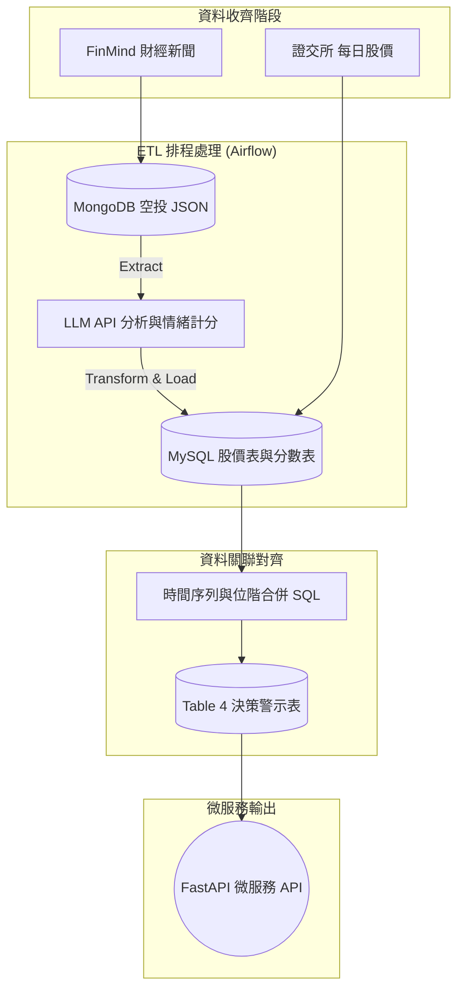

# 股票市場情緒分析與防呆避險系統 - 專案企劃書

作為期末專題，本專案不只是單純的爬蟲練習，而是一套具有真實商業價值的「資料工程與量化分析系統」。以下是專案的核心定義與藍圖方向，供團隊討論與對齊共識。

---

## 一、 為何要製作這個專案？ (Why)

在當前資訊爆炸的時代，散戶投資人最大的痛點是：**「容易被媒體帶風向，導致追高殺低，成為最後一隻老鼠」**。

這個系統就是散戶的**「防割韭菜神器」**，能直接解決底下三個最常見的痛點：

**🎯 情境 1：買進前的「測謊確認」 / 防追高（避開主力出貨文）**
- **痛點**：下班看到新聞狂報「台積電營收創新高」，腦熱隔天開盤買進，結果立刻套牢。
- **解法**：系統會對照股價和新聞，告訴你「現在大家超級樂觀，但股價早就漲三天了」。這代表利多早就發酵，現在發新聞可能是主力要倒貨給你，叫你冷靜別買。

**🎯 情境 2：滿地鮮血時的「抄底勇氣」 / 敢抄底（克服恐慌撿便宜）**
- **痛點**：股市大跌、新聞全在喊崩盤，你嚇到把股票全部砍在最低點（阿呆谷）。
- **解法**：系統測出現在市場「極度恐慌」，並拿出歷史數據跟你說：「過去恐慌成這樣的時候，未來一週反彈機率有 80%」。你有客觀數據壯膽，就不會亂賣，甚至還敢分批進場撿便宜。

**🎯 情境 3：免盯盤（即時避險）** (目前為規劃中功能)
- **痛點**：上班沒空看盤，常常下班才發現股票已經跌停。
- **解法**：只要你關注的股票（例如 0050 或台積電）在短時間內爆出大量負面新聞，系統會第一時間傳 LINE 提醒你，讓你不用盯盤也能及時出場。

---

## 二、 它是怎麼運作的？ (How)

系統的核心邏輯在於「把主觀的文字，完美對齊客觀的金錢軌跡」。具體分為四步：

1. **時間精準的資料收集 (Time-Series Synchronization)**
   為了給散戶在「開盤下單前」有防呆決策的時間，我們的資料抓取與對齊時間點定義如下：
   - **🗞️ 新聞蒐集時間點**：每天盤前 (例如 08:00) 結算。蒐集區間為 `[昨天下午 14:00 (昨天盤後) 到 今天早上 08:00 (今天盤前)]` 的所有新聞。
   - **📈 對應股價時間點 (位階)**：系統判斷新聞真偽的基準位階，是看 `[T-3日至 T-1日 (昨天)]` 的歷史收盤價，看股價是否早已偷跑。
   - **🎯 驗證預測目標**：以 `[T日 (今天)]` 的真實漲跌幅，來驗證這批新聞情緒的效力。

2. **機器無情判讀 (LLM 賦能)**：直接呼叫輕量級大型語言模型 API (如 GPT-4o-mini)，利用其強大的語意理解能力，將每一篇新聞精準剖析並量化成 `[-1.0 到 1.0]` 的情緒分數。
3. **資料庫關聯運算**：在資料庫把今日總情緒分數與歷史股價進行 JOIN。
4. **輸出決策訊號**：依據位階與情緒值的背離程度，輸出「紅綠燈」防呆訊號。

### 🚀 系統架構流 (Data Pipeline)

---

## 三、 我們使用了哪些技術？ (What)

本專案完美融入在職班的核心課程，打造 MLOps 作品集火力：
1. **資料湖泊 (Data Lake)**：用 **MongoDB** 存放爬蟲抓來的非結構化原始新聞 (JSON)。
2. **AI 情緒分析 (LLM API)**：捨棄傳統詞典，導入 **GPT-4o-mini 等輕量級語言模型 API** 進行財經新聞的深層語意判讀與量化。
3. **自動化管線 (Orchestration)**：以 **Airflow** 分散式系統每日調度 `爬蟲 -> LLM 判讀 -> DB` 流程。
4. **資料倉儲 (Data Warehouse)**：在 **MySQL** 內存放清洗好的價格、分數，並進行關聯 JOIN。
5. **雲端微服務部署 (Serving)**：用 **FastAPI** 撰寫後端警報接口，並藉由 **Docker-Compose** 將所有服務容器化佈署到 **GCP** 雲端 24 小時運作。

---

## 四、 隊長待確認事項與 MVP 階段 (Action Items)

> [!IMPORTANT]
> 為了專案能順利落地產出，隊長請在開會時與團隊對齊第一階段的 MVP（最小可行產品）目標：
> 1. **鎖定 5 檔話題名單**：台積電(2330)、國巨(2327)、緯創(3231)、南亞科(2408)、聯發科(2454)。
> 2. **鎖定 7 月時間窗**：只先針對這五檔「7月份」的新聞與股價進行抓取與情緒計分。
> 3. **核心任務**：先別管 Airflow，所有人齊心把這五檔 7 月的回測跑出「情緒與股價圖表」，驗證「測謊機情境」真實有效後，第二階段再把工程服務 (Docker/GCP) 掛上去！
