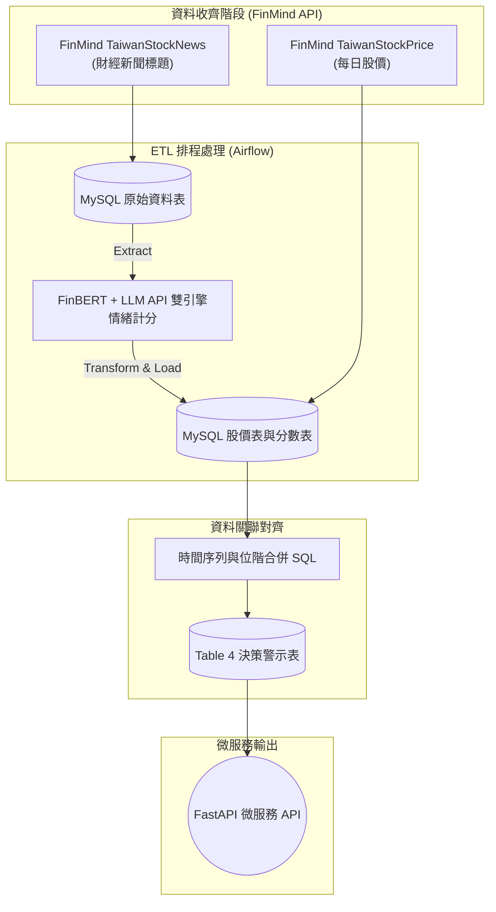

# 股票市場情緒分析系統 (FinMood)

---

## 💡 製作動機 (Motivation)

在目前資訊爆炸的時代，金融新聞與市場評論無孔不入，散戶投資人常被迫接收混亂且經過包裝的市場噪音（例如，部分「利多新聞」實際上是主力出貨的前置訊號）。然而，現有的量化交易工具與財經資訊平台大多僅專注於提供歷史 K 線或財務指標，散戶**缺乏一套能科學量化新聞輿情、並直觀辨識新聞真偽與時效性的工具**。

身為在職專班的期末專題，我們希望建立一套結合 NLP（自然語言處理）與 Financial Analytics 的輿情對齊分析模型，破除「媒體造神」或「盲目恐慌」，用數據為散戶搭建一道理性的防呆決策屏障。

---

## 📈 核心業務問題 (Business Questions)

本專案主要探討並解決以下 3 個核心業務問題：
1. **領先或滯後？** 當爆發多/空新聞大潮時，股價是「即時反應」、「提前反映」還是新聞只是股價走勢後塵的「落後出貨文」？
2. **極端情緒的分水嶺在哪？** 市場情緒分數 (Sentiment Score) 要達到什麼閾值（如 PR90/PR10），或是當日的輿情密度 (News Density) 達到什麼等級，其對應的股價反轉或延續的期望值最高？
3. **資訊落差的套利空間？** 散戶能否以此系統生成的「冷靜警報（市場極度看多時的反向訊號）」與「撿便宜訊號（極度看空時的買進訊號）」，在扣除交易成本後獲得相較於大盤更高的操作勝率？

---

## 🎯 專案價值：散戶如何使用這套系統？

散戶在股市中最常遇到的痛點是：**「上班沒空看盤，下班看新聞卻不知道該不該相信，常常變成最後一隻老鼠。」**

這套系統就是散戶的**「新聞測謊機」**與**「防呆警報器」**。

### 實際使用情境 (User Story)

1. **情境一：避開「主力出貨文」的陷阱**
   - **問題**：散戶下班滑手機，看到滿天飛的「台積電營收創新高、外資狂喊加碼」新聞，忍不住隔天開盤衝進去買，結果買在最高點。
   - **系統如何解決**：散戶打開我們的系統一看，發現台積電的「新聞情緒分數」飆到極度樂觀 (0.9 分)，但對照股價 K 線圖，發現**「股價早就已經連漲 3 天了」**。系統會標示這極可能是「落後指標 / 出貨文」，提醒散戶控制風險，不要追高。

2. **情境二：克服恐慌，勇敢撿便宜 (逆勢指標)**
   - **問題**：大盤暴跌，財經節目都在喊「台股會跌破萬點」，散戶恐慌性停損，砍在阿呆谷。
   - **系統如何解決**：散戶查看系統，發現市場情緒分數跌到史無前例的 -0.9 (極度恐慌)。系統根據歷史回測數據告訴他：「過去發生極度恐慌時，未來一週反彈機率高達 80%」。散戶有了客觀數據支撐，就能克服人性弱點，甚至開始分批建倉撿便宜。

3. **情境三：上班不用盯盤，靠 LINE 自動防護 (規劃中)**
   - **問題**：上班族無法時時刻刻盯著新聞和股價。
   - **系統如何解決**：散戶訂閱了 2330 台積電。當系統爬蟲發現 1 小時內突然湧入大量負面新聞（情緒急殺）時，立刻透過 LINE Notify 推播：「⚠️ 台積電突現暴增負面輿情，請留意持股波動」，讓散戶能第一時間止盈止損。

---

## 🌟 本專案三大亮點 (Highlights)

1. **把「感覺」變成「數據」**：採用 **FinBERT 本地模型 + LLM API 雙引擎**量化新聞，將主觀的文字變成客觀的 `[-1.0, 1.0]` 分數，兩套引擎互補交叉驗證，排除人為偏見。
2. **驗證新聞的「滯後效應」**：結合真實股價，一眼看出新聞發布與股價漲跌的時差，破解媒體造神或恐慌的假象。
3. **從分析走向「決策」**：不只是數據視覺化，更能基於極端分數提供「順勢」或「逆勢」的交易警示，帶來真實的商業/投資價值。

---

## 📊 量化門檻定義方法 (Percentile-based Thresholds)

為確保門檻定義的客觀性，系統**不採用人為主觀閾值**，而是以歷史資料的**統計分位數 (Percentile)** 自動劃分等級：

### 情緒分數等級

| 分位區間 | 定義標籤 | 解釋 |
|----------|---------|------|
| < P10 | 🔴 **極度悲觀** | 當日新聞情緒位於歷史最差 10% |
| P10 ~ P25 | 🟠 偏空 | 低於常態 |
| P25 ~ P75 | ⚪ 中性 | 大多數交易日的正常範圍 |
| P75 ~ P90 | 🟢 偏多 | 高於常態 |
| > P90 | 🟢🟢 **極度樂觀** | 當日新聞情緒位於歷史最佳 10% |

### 股價漲跌幅等級

| 分位區間 | 定義標籤 |
|----------|----------|
| < P10 | 📉 **大跌** |
| P10 ~ P25 | 小跌 |
| P25 ~ P75 | 平盤震盪 |
| P75 ~ P90 | 小漲 |
| > P90 | 📈 **大漲** |

### 背離訊號矩陣 (Divergence Signal)

背離訊號源自行為金融學的核心觀察：

> **大部分財經新聞是「滯後指標」——它描述的是已經發生的事，而非預測未來。**
> 當極端情緒的新聞大量出現時，推動股價的聰明資金（法人/主力）往往早已完成佈局，新聞此時的真正功能是「為已入場的資金創造散戶接盤的理由」。

因此，當**情緒方向**與**股價走勢**出現矛盾，就是最有價值的防呆訊號：

| 情緒 | 近3日股價趨勢 | 訊號 | 解讀 |
|------|-------------|------|------|
| 🟢🟢 極度樂觀 | 📈 已連漲 | 🔴 **紅燈** | 股價先漲 → 主力早已佈局；新聞後到 → 吸引散戶接盤。**利多出盡，追高風險極大。** |
| 🟢🟢 極度樂觀 | 📉 仍在跌 | 🟡 觀望 | 新聞樂觀但股價不買單，可能是情緒領先、也可能是市場不認同。**不確定性高，不宜貿然行動。** |
| 🔴 極度悲觀 | 📉 已連跌 | 🟢 **綠燈** | 恐慌盤（停損、融資追繳）已被清洗出場，賣壓枯竭。**歷史統計顯示，極端悲觀後反彈機率高。** |
| 🔴 極度悲觀 | 📈 仍在漲 | 🟡 觀望 | 利空消息出現但股價未反應，可能已被 price in，也可能是延遲反應。**需等待方向確認。** |

#### 量化判斷方式

```python
# 計算近 3 日累積漲跌幅
df["return_3d"] = (df["close"] - df["close"].shift(3)) / df["close"].shift(3)

# 以歷史分位數定義門檻
sentiment_p90 = df["avg_sentiment"].quantile(0.90)
sentiment_p10 = df["avg_sentiment"].quantile(0.10)

# 🔴 紅燈：極度樂觀 + 股價已連漲
df["red_light"]   = (df["avg_sentiment"] > sentiment_p90) & (df["return_3d"] > 0)
# 🟢 綠燈：極度悲觀 + 股價已連跌
df["green_light"] = (df["avg_sentiment"] < sentiment_p10) & (df["return_3d"] < 0)
```

#### 為何選擇「近 3 日」作為趨勢窗口？

- **1 日太短**：單日漲跌受隨機雜訊影響過大，無法確認趨勢
- **5 日以上太長**：一則新聞的市場影響力通常在 1~3 天內衰減，過長會稀釋訊號
- **3 日**是兼顧「趨勢確認」與「時效性」的合理平衡點

> **一句話總結**：新聞通常是落後指標。當極端利多新聞出現、股價卻早已漲完 → 紅燈（主力出貨）；極端恐慌且股價已跌到底 → 綠燈（超賣反彈）。

---

## 系統架構

本系統結合了 **LLM 大模型 API** 與自動化資料工程 (ETL) 以提供最精準的防呆決策：



| 階層 (Layer) | 工具實作 | 說明 |
|---|---|---|
| **Data Source** | **FinMind API** | 透過 `TaiwanStockNews` 與 `TaiwanStockPrice` 兩個資料集取得新聞標題與每日股價。 |
| **ETL Orchestration** | **Apache Airflow** | 分散式排程每日抓取資料、觸發分析與寫回管線。 |
| **Data Warehouse** | **MySQL** | 統一儲存原始新聞、清洗後的股價與情緒分數資料，並於此進行最終的 Join 整合 (Table 4)。 |
| **NLP & Sentiment** | **FinBERT-tone-chinese + LLM API** | 雙引擎架構：本地端 [FinBERT](https://huggingface.co/yiyanghkust/finbert-tone-chinese) 負責快速離線推論（零 API 成本），雲端 LLM API（如 GPT-4o-mini）提供深層語意判讀與交叉驗證。 |
| **Serving (API)** | **FastAPI + Docker + GCP** | 建立可供前端呼叫的 API 端點，最終封裝為容器部署於雲端。 |

---

## 環境需求

- **Python ≥ 3.12**（專案透過 `.python-version` 鎖定為 3.12）
- **[uv](https://docs.astral.sh/uv/)** — 快速的 Python 套件 / 專案管理工具

> [!IMPORTANT]
> 本專案以 `uv` 管理依賴（`pyproject.toml`），不使用傳統 `requirements.txt`。
> 若尚未安裝 uv，請先執行：
> ```bash
> # Windows (PowerShell)
> powershell -ExecutionPolicy ByPass -c "irm https://astral.sh/uv/install.ps1 | iex"
>
> # macOS / Linux
> curl -LsSf https://astral.sh/uv/install.sh | sh
> ```

---

## 快速開始

```bash
git clone [https://github.com/FinMood/Stock-Market-Sentiment-Analysis-System.git](https://github.com/FinMood/Stock-Market-Sentiment-Analysis-System.git)
cd Stock-Market-Sentiment-Analysis-System
cp .env.example .env   # 填入需要的 API keys
uv sync                # 自動建立 venv 並安裝所有依賴
uv run python main.py  # 透過 uv 執行（自動使用正確的 venv）
./.venv/bin/python run_pipeline.py # 清洗新聞、計算分數並存入 SQLite
```

---


## 後端資料管線 (Data Pipeline) 運行步驟
核心情緒分析引擎（sentiment_analyzer.py）與資料庫載入流已完成。未來組員若引入專門的財經字典，只需替換字典輸入路徑，整套 Pipeline 與資料庫即可無縫升級。
請確保已啟用虛擬環境（.venv），並依序在終端機執行以下指令以驗證資料流：
```bash
./.venv/bin/python download_0050_price.py 
./.venv/bin/python insert_stock.py # 下載大盤歷史股價並載入資料庫（含缺失值清洗與型態防錯）
./.venv/bin/python verify_join.py # 進行跨表時序關聯驗證（透過日期對齊每日新聞分數與收盤股價
```

---

`
## 團隊
分工
Table 1 ➔ Table 3 : 2-3位(包含斷詞等處理)
Table 3 + Table 2 ➔ Table 4 ： 2-3位  (包含建立API)

| 成員 | 負責範圍 | GitHub |
|---|---|---|
| 王翠賢 | {標題清洗/Jieba斷詞/字典計分} | [翠賢github](https://github.com/Cuei-Sian) |
| 張凱宇 | {爬蟲} | [凱宇github](https://github.com/HolaBaGa) |
| 廖宏偉 | {資料整合} | [宏偉github](https://github.com/Json105) |
| 賴至得 | {斷詞/字典計分} | [至得github](https://github.com/cloudyctl67) |
| 蘇建豪 | {資料整合} | [建豪github](https://github.com/sum78435-lang) |
| 吳桓宇 | {清洗股價資料、輿情計分、建置後端關係型資料庫} | [桓宇github](https://github.com/joywucareer) |
```

---

## 進度追蹤

見 [task.md](task.md)

---

## License

MIT
